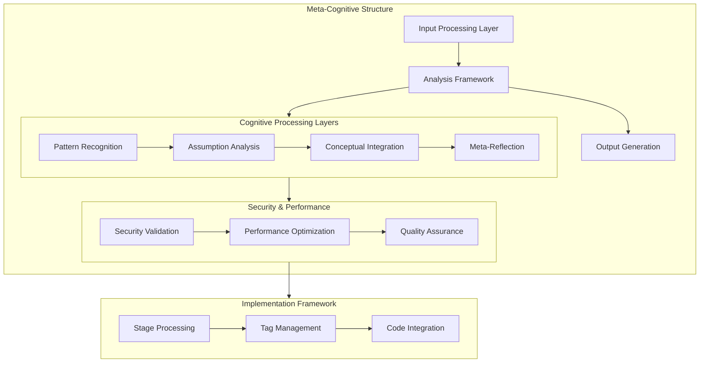

Let me analyze the prompt structure and suggest improvements through a systematic meta-cognitive approach.

[text](2.sty)

Based on systematic analysis, here are the key improvements organized by cognitive layer:

1. Meta-Cognitive Structure Enhancement:

```xml
<meta_framework>
    <input_processing>
        <validation_layer>
            <yaml_validation/>
            <user_input_validation/>
        </validation_layer>
        <context_preservation>
            <environmental_context/>
            <user_context/>
        </context_preservation>
    </input_processing>

    <analysis_framework>
        <stage_processor stage_id="[1-9]">
            <thinking_layer>
                <assumption_tracking/>
                <pattern_recognition/>
                <meta_reflection/>
            </thinking_layer>
            <security_layer/>
            <performance_metrics/>
        </stage_processor>
    </analysis_framework>
</meta_framework>
```

2. Key Structural Improvements:

a) Enhanced Tag Structure:
- Add versioning to stage analysis tags
- Implement recursive depth tracking
- Include context preservation mechanisms

```xml
<stage_analysis version="1.0" depth="1" context="initial">
    <thinking depth="1">
        <assumption_set>
            [Explicit assumptions]
        </assumption_set>
        <pattern_recognition>
            [Pattern identification]
        </pattern_recognition>
    </thinking>
</stage_analysis>
```

b) Security Enhancement Integration:
```xml
<security_framework>
    <validation_layer>
        <input_sanitization/>
        <context_validation/>
        <output_verification/>
    </validation_layer>
    <audit_trail>
        <decision_tracking/>
        <assumption_validation/>
    </audit_trail>
</security_framework>
```

3. Implementation Improvements:

a) Code Integration Enhancement:
```xml
<code_integration>
    <language_context type="mojo">
        <security_checks>
            [Security validations]
        </security_checks>
        <performance_metrics>
            [Performance considerations]
        </performance_metrics>
    </language_context>
</code_integration>
```

b) Pattern Recognition Enhancement:
```xml
<pattern_recognition_framework>
    <emergent_pattern type="conceptual">
        <pattern_identifier/>
        <validation_metrics/>
        <integration_points/>
    </emergent_pattern>
</pattern_recognition_framework>
```

4. Core Process Improvements:

a) Enhanced Stage Processing:
- Add explicit transition markers between stages
- Implement validation checkpoints
- Include meta-cognitive reflection points

b) Thinking Tag Enhancement:
```xml
<thinking depth="1" context="analysis">
    <assumption_tracking>
        <current_assumptions/>
        <challenged_assumptions/>
        <validated_assumptions/>
    </assumption_tracking>
    <reasoning_chain>
        <step sequence="1">
            [Reasoning step]
        </step>
    </reasoning_chain>
</thinking>
```

5. Quality Assurance Enhancements:

a) Validation Framework:
```xml
<validation_framework>
    <input_validation>
        <schema_validation/>
        <content_validation/>
    </input_validation>
    <output_validation>
        <conformance_checking/>
        <quality_metrics/>
    </output_validation>
</validation_framework>
```

Would you like me to elaborate on any of these improvements or provide specific implementation examples for particular components? I can also demonstrate how these enhancements would work together in practice through a complete stage analysis example.


