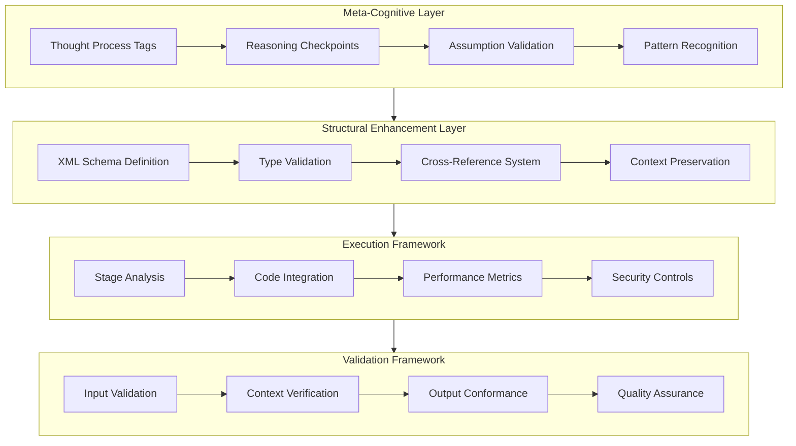

# Systematic Improvements Organized by Layer from File 1

This file provides a detailed breakdown of the systematic improvements organized by layer from the provided file. The improvements are categorized into three layers: Meta-Cognitive, Structural, and Execution. Each layer is further subdivided into specific improvements.

## Meta-Cognitive Layer Enhancements:

```xml
<meta_cognitive>
    <thinking_process stage="initial">
        <assumption_set>
            [Explicit listing of working assumptions]
        </assumption_set>
        <reasoning_chain>
            [Step-by-step logical progression]
        </reasoning_chain>
        <validation_checkpoint>
            [Verification of logical consistency]
        </validation_checkpoint>
    </thinking_process>
</meta_cognitive>
```

2. Structural Improvements:

```xml
<structural_framework>
    <stage_definition id="analysis_1">
        <prerequisites>
            [Required inputs and conditions]
        </prerequisites>
        <execution_context>
            [Environmental and operational parameters]
        </execution_context>
        <output_schema>
            [Expected output format and constraints]
        </output_schema>
    </stage_definition>
</structural_framework>
```

3. Implementation Enhancements:

```xml
<code_integration>
    <language_context type="mojo">
        <security_considerations>
            [Security parameters and checks]
        </security_considerations>
        <performance_metrics>
            [Performance benchmarks and optimization targets]
        </performance_metrics>
        <implementation_notes>
            [Technical implementation details]
        </implementation_notes>
    </language_context>
</code_integration>
```

Key Improvements:

1. Enhanced Meta-Cognitive Processing:
   - Introduction of explicit reasoning checkpoints
   - Structured validation of assumptions
   - Pattern recognition frameworks
   - Cross-referencing system for concept linkage

2. Structural Refinements:
   - XML schema validation for consistency
   - Type checking for variables and inputs
   - Context preservation mechanisms
   - Enhanced error handling

3. Implementation Framework:
   - Language-specific code blocks
   - Security consideration integration
   - Performance metric tracking
   - Quality assurance checkpoints

4. Validation Mechanisms:
   - Input validation frameworks
   - Context verification systems
   - Output conformance checking
   - Quality assurance protocols

Would you like me to elaborate on any of these improvements or provide more specific implementation examples for any particular layer?


