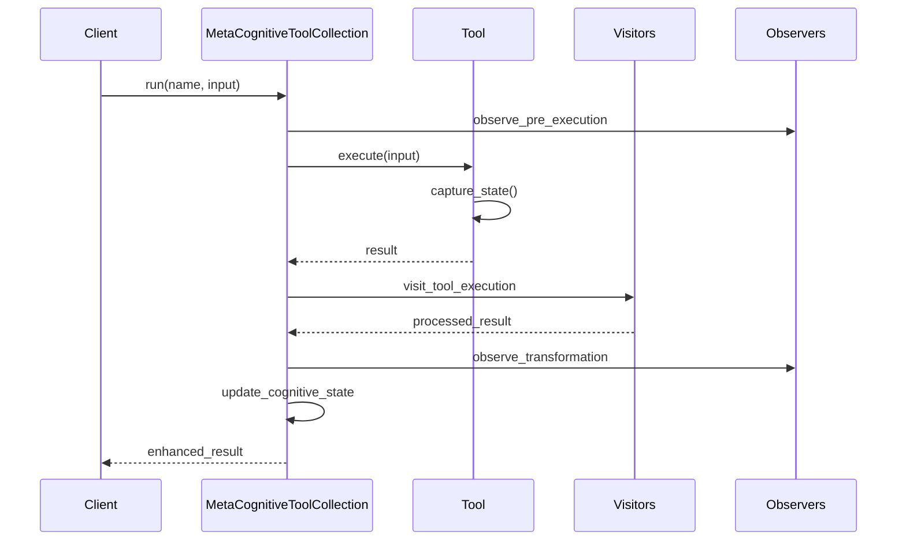

# Meta-Cognitive Architecture

## Overview

The meta-cognitive architecture enhances the computer use demo with self-monitoring, pattern recognition, and adaptive capabilities. This document describes the core components and their interactions.

## Core Components

### MetaCognitiveToolCollection

The central coordinator for meta-cognitive capabilities:

- Manages tool execution with meta-cognitive monitoring
- Coordinates visitors and observers
- Maintains shared context and cognitive state
- Handles pattern recognition and adaptations

```python
MetaCognitiveToolCollection(
    tools=[MetaComputerTool, ...],
    config={
        "observation": {
            "state_tracking": bool,
            "pattern_analysis": bool
        },
        "adaptation": {
            "enabled": bool,
            "threshold": float
        }
    }
)
```

### MetaCognitiveState

Tracks the cognitive aspects of tool execution:

- Patterns: Recognized execution patterns
- Adaptations: Applied tool adaptations
- Metrics: Performance and stability metrics
- Timestamp: State update timing

### Enhanced Tools

Base tools enhanced with meta-cognitive capabilities:

- State tracking
- Pattern learning
- Performance metrics
- Adaptive behavior

## Visitor System

The visitor system provides structured analysis of tool execution:

### ToolVisitor
- ValidationVisitor: Validates tool inputs and outputs
- ParsingVisitor: Parses and structures tool results
- TransformationVisitor: Transforms results for analysis

## Observer System

Monitors and analyzes tool execution:

### Observers
- StateObserver: Tracks tool state changes
- TransformationObserver: Monitors result transformations
- BoundaryObserver: Checks execution boundaries

## Integration Points

### 1. Tool Execution Flow



### 2. Pattern Recognition

The system recognizes patterns in:
- Tool state changes
- Execution results
- Resource usage
- Error patterns

### 3. Adaptations

Tools can adapt based on:
- Recognized patterns
- Performance metrics
- Resource constraints
- Error rates

## Streamlit Integration

The UI provides visibility into meta-cognitive processes:

### Meta-Cognitive Insights
- Execution patterns
- Tool adaptations
- Performance metrics
- Tool execution history

### Visualization
- Pattern timelines
- Metric trends
- Adaptation history

## Usage Examples

### 1. Basic Usage

```python
# Initialize meta-cognitive tools
tool_collection = MetaCognitiveToolCollection(
    MetaComputerTool(),
    config={
        "observation": {"state_tracking": True},
        "adaptation": {"enabled": True}
    }
)

# Execute with monitoring
result = await tool_collection.run("computer", {
    "action": "take_screenshot"
})

# Access insights
patterns = result.patterns
metrics = result.metrics
```

### 2. Pattern Analysis

```python
# Access pattern history
patterns = tool_collection.cognitive_state.patterns

# Analyze specific pattern types
state_changes = [p for p in patterns if p["type"] == "state_change"]
performance_patterns = [p for p in patterns if p["type"] == "performance"]
```

### 3. Adaptation Examples

```python
# Configure adaptation thresholds
tool_collection.config["adaptation"]["threshold"] = 0.7

# Monitor adaptations
adaptations = tool_collection.cognitive_state.adaptations
```

## Testing

The framework includes comprehensive tests:

- Unit tests for all components
- Integration tests for tool interactions
- Pattern recognition tests
- Adaptation tests
- UI component tests

## Future Enhancements

1. Advanced Pattern Recognition
   - Machine learning integration
   - Historical pattern analysis
   - Cross-tool pattern correlation

2. Adaptive Strategies
   - Dynamic threshold adjustment
   - Resource optimization
   - Error prevention

3. Enhanced Visualization
   - Interactive pattern explorer
   - Real-time metric dashboards
   - Adaptation impact analysis

## Contributing

To extend the meta-cognitive capabilities:

1. Add new pattern types in `MetaComputerTool`
2. Implement new observers in the observer system
3. Enhance the visitor system with new analysis types
4. Add visualization components to the Streamlit interface
