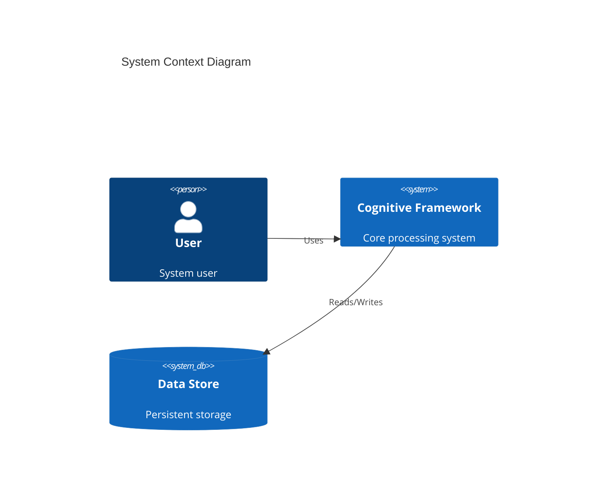
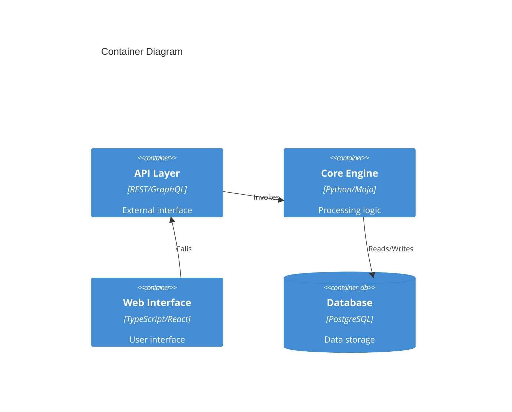
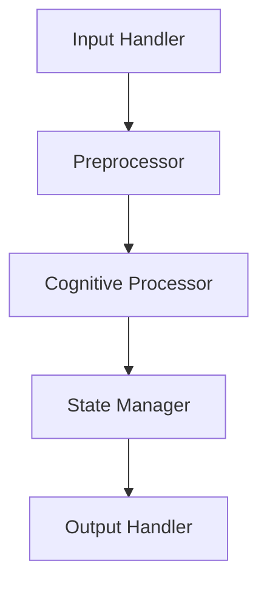
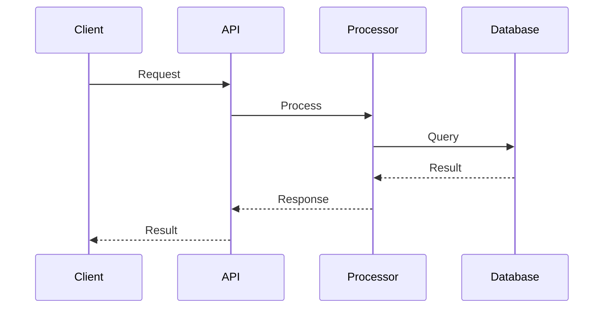
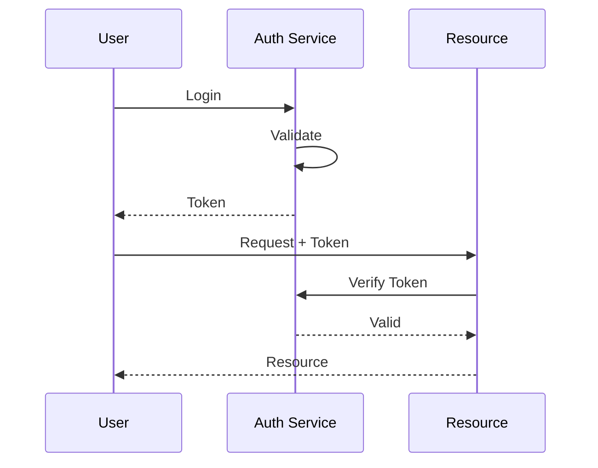
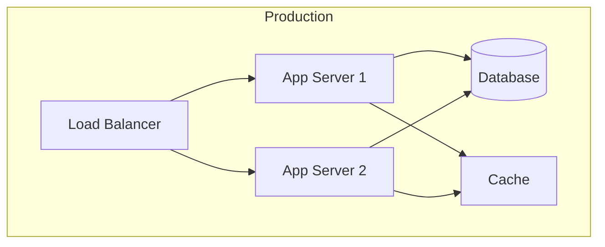
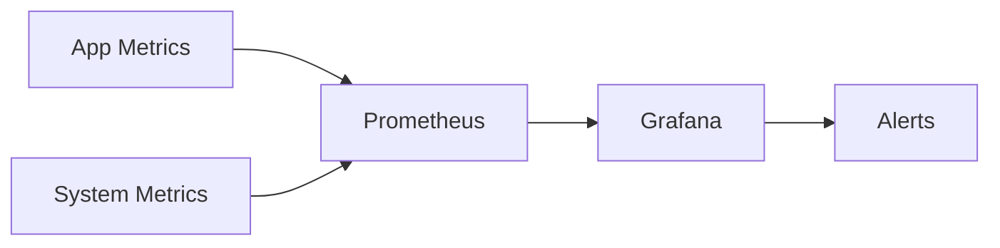

# System Architecture

## Overview

High-level description of the system architecture.

## System Context

## Container View

## Component Architecture

### Core Processing Engine

### Data Flow

## Technology Stack

### Backend
- Language: Python 3.9+
- Framework: FastAPI
- Database: PostgreSQL
- Cache: Redis

### Frontend
- Framework: React
- Language: TypeScript
- State Management: Redux
- UI Components: Material-UI

### Infrastructure
- Container: Docker
- Orchestration: Kubernetes
- CI/CD: GitHub Actions
- Monitoring: Prometheus/Grafana

## Security Architecture

### Authentication Flow

### Security Measures
- JWT-based authentication
- Role-based access control
- API rate limiting
- Data encryption at rest
- SSL/TLS encryption in transit

## Scalability

### Horizontal Scaling
- Load balancing strategy
- Database sharding approach
- Caching strategy

### Vertical Scaling
- Resource allocation
- Performance optimization
- Memory management

## Deployment Architecture

## Monitoring Architecture

### Metrics Collection

### Key Metrics
- Response time
- Error rates
- Resource utilization
- Business metrics

## Disaster Recovery

### Backup Strategy
- Backup frequency
- Retention policy
- Recovery procedures

### Failover Process
- High availability setup
- Automated failover
- Manual intervention procedures

## References

- Architecture decision records
- Design documents
- External documentation
