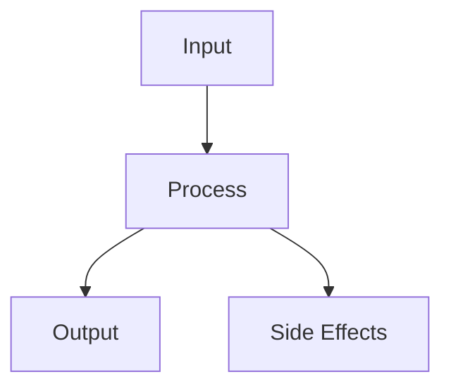

# Component Name

## Overview

Brief description of the component and its purpose.

## Architecture



## Implementation

### Dependencies

- List of required dependencies
- Version requirements
- Optional features

### Core Classes

#### `ClassName`

```python
class ClassName:
    """
    Class description.
    """
    def method(self, param: Type) -> ReturnType:
        """Method description."""
        pass
```

### Configuration

```yaml
component:
  setting1: value1
  setting2: value2
  nested:
    setting3: value3
```

## Usage

### Basic Example

```python
from package import Component

component = Component()
result = component.process(input_data)
```

### Advanced Patterns

Describe advanced usage patterns and best practices.

## Testing

### Unit Tests

Describe key test cases and how to run them.

### Integration Tests

Describe integration test scenarios.

## Performance

### Benchmarks

Include relevant benchmark results and methodology.

### Optimization Tips

List performance optimization guidelines.

## Security Considerations

- Security best practices
- Known limitations
- Authentication requirements

## Error Handling

| Error Code | Description | Resolution |
|------------|-------------|------------|
| E001 | Description of error | How to fix |
| E002 | Description of error | How to fix |

## Monitoring

### Metrics

- List of important metrics to monitor
- Expected ranges
- Alert thresholds

### Logging

Describe logging patterns and important log messages.

## Contributing

Guidelines for contributing to this component.

## References

- Link to related documentation
- External resources
- Research papers
