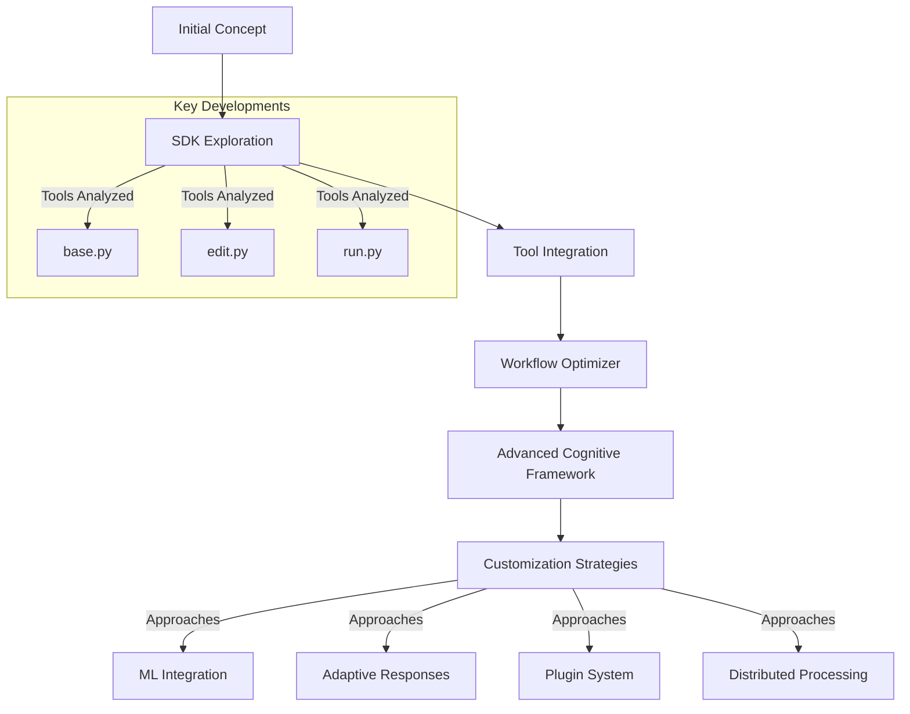

I'll create a timeline of our conversation, highlighting the key developments and conceptual progressions:

### Conversation Timeline: Cognitive Framework Development

1. **Initial Exploration: Claude Comp Use SDK**
   - Discussed the potential of using the Claude Comp Use SDK
   - Explored tools for cognitive enhancement and system evolution
   - Identified key areas of focus:
     * Recursive Understanding
     * Meta-Cognitive Emergence
     * Dynamic Interactions

2. **Tool Integration Phase**
   - Examined tools from `anthropic-quickstarts-main/computer-use-demo/tools/`
   - Analyzed key files:
     * `base.py`: Foundational tool classes
     * `edit.py`: File editing capabilities
     * `run.py`: Shell command execution
     * `computer.py`: System interaction tools
     * `collection.py`: Tool management

3. **First Implementation: Meta-Cognitive Workflow Optimizer**
   - Created `MetaCognitiveWorkflowOptimizer`
   - Key Features:
     * Performance tracking
     * Workflow monitoring
     * Error logging
     * Insight generation

4. **Advanced Cognitive Framework Development**
   - Developed `CognitiveFramework` class
   - Implemented core functionalities:
     * Recursive processing
     * Dynamic interaction modeling
     * Interaction memory management
     * Detailed logging system

5. **Customization Exploration**
   - Proposed advanced customization approaches:
     * Machine Learning Integration
     * Advanced Adaptive Response Generation
     * Extensible Plugin System
     * Distributed Cognitive Processing

### Conceptual Evolution

### Emerging Themes
1. **Recursive Self-Improvement**
   - Developing systems that can analyze and refine themselves
   - Creating adaptive, learning-capable frameworks

2. **Cognitive Flexibility**
   - Building tools that can dynamically respond to different contexts
   - Implementing meta-cognitive awareness

3. **Extensibility**
   - Designing frameworks that can be easily customized
   - Supporting plug-and-play cognitive processing components

### Next Potential Steps
1. Implement specific customization strategies
2. Develop domain-specific cognitive processing modules
3. Create comprehensive testing and validation frameworks
4. Explore advanced machine learning integration techniques

Would you like me to elaborate on any part of this timeline or discuss potential future directions for the cognitive framework?
