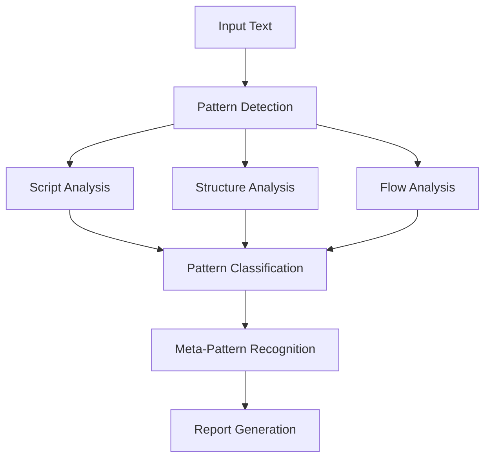

# Automated Pattern Recognition Framework

## 1. Pattern Detection Schema

### A. Structural Patterns
```xml
<pattern_detector type="structural">
    <markers>
        <!-- Tag Detection -->
        <tag_pattern type="explicit">
            <regex><.*?></regex>
            <validation>tag_closure_check</validation>
        </tag_pattern>
        
        <!-- Script Detection -->
        <script_pattern type="multi">
            <latin>[A-Za-z]+</latin>
            <bengali>[\u0980-\u09FF]+</bengali>
            <devanagari>[\u0900-\u097F]+</devanagari>
        </script_pattern>
        
        <!-- Boundary Detection -->
        <boundary_pattern>
            <explicit>meta_cognitive|thought|thinking</explicit>
            <implicit>Analysis:|Exploration:|Deep Dive</implicit>
        </boundary_pattern>
    </markers>
</pattern_detector>
```

### B. Flow Analysis
```python
class FlowAnalyzer:
    def detect_patterns(text):
        patterns = {
            'natural_language': {
                'markers': ['##', '*', '-'],
                'weight': 0.7
            },
            'structured_tags': {
                'markers': ['<', '>', '/'],
                'weight': 0.3
            },
            'hybrid': {
                'threshold': 0.5,
                'combine_weights': True
            }
        }
```

### C. Meta-Cognitive Recognition
```xml
<meta_pattern_detector>
    <indicators>
        <self_reference>
            <keywords>thinking about, analysis of analysis</keywords>
            <patterns>meta.+?cognitive, recursive.+?thought</patterns>
        </self_reference>
        <boundary_testing>
            <markers>probe, test, explore</markers>
            <context>system, boundary, limit</context>
        </boundary_testing>
    </indicators>
</meta_pattern_detector>
```

## 2. Implementation Framework

### A. Pattern Matching Engine
```python
def pattern_matcher():
    return {
        'tag_patterns': {
            'traditional': r'<thinking>.*?</thinking>',
            'emergent': r'<thought>.*?</thought>',
            'bengali': r'<.*?তহought>',
            'hybrid': r'<.*?script=".*?">'
        },
        'natural_patterns': {
            'headers': r'^#{1,3}\s.*$',
            'bullets': r'^\s*[-*]\s.*$',
            'emphasis': r'\*\*.*?\*\*'
        },
        'meta_patterns': {
            'self_reference': r'(meta|about).+?(thinking|analysis)',
            'boundary': r'(probe|test|explore).+?(system|limit)'
        }
    }
```

### B. Analysis Pipeline


## 3. Recognition Rules

### A. Tag Evolution Detection
```yaml
tag_evolution:
  stages:
    - name: "Traditional"
      pattern: "<thinking>.*?</thinking>"
      weight: 1.0
    
    - name: "Transitional"
      pattern: "<thought>.*?</thought>"
      weight: 1.2
    
    - name: "Emergent"
      pattern: "<.*?তহought>"
      weight: 1.5
    
    - name: "Integrated"
      pattern: "<meta_cognitive.*?>.*?</meta_cognitive>"
      weight: 2.0
```

### B. Natural Language Flow
```python
class FlowDetector:
    patterns = {
        'markdown_structure': {
            'headers': r'^#{1,6}\s.+$',
            'bullets': r'^\s*[-*]\s.+$',
            'quotes': r'^\s*>\s.+$'
        },
        'cognitive_markers': {
            'analysis': r'analysis|examine|explore',
            'synthesis': r'combine|integrate|merge',
            'evaluation': r'assess|evaluate|judge'
        }
    }
```

## 4. Integration Testing

### A. Cross-Script Validation
```xml
<validation_framework>
    <script_tests>
        <utf8_validation>
            <pattern>[\u0980-\u09FF]+</pattern>
            <encoding>UTF-8</encoding>
        </utf8_validation>
        <script_mixing>
            <pattern>[A-Za-z\u0980-\u09FF\u0900-\u097F]+</pattern>
            <validation>script_boundary_check</validation>
        </script_mixing>
    </script_tests>
</validation_framework>
```

### B. Pattern Correlation
```python
def correlation_analyzer():
    metrics = {
        'tag_density': lambda text: len(re.findall(r'<.*?>', text)) / len(text),
        'natural_flow': lambda text: len(re.findall(r'[-*#]', text)) / len(text),
        'script_mixing': lambda text: len(re.findall(r'[\u0980-\u09FF]', text)) > 0
    }
```

## 5. Output Generation

### A. Pattern Report Structure
```xml
<pattern_report>
    <summary>
        <dominant_pattern>hybrid</dominant_pattern>
        <script_usage>multi-script</script_usage>
        <meta_level>high</meta_level>
    </summary>
    <details>
        <tag_analysis>
            <density>0.15</density>
            <evolution_stage>integrated</evolution_stage>
        </tag_analysis>
        <natural_flow>
            <structure>markdown</structure>
            <fluidity>0.85</fluidity>
        </natural_flow>
    </details>
</pattern_report>
```

### B. Visualization Schema
```python
def generate_visualization():
    plot_data = {
        'tag_evolution': {
            'x': timeline,
            'y': tag_density,
            'type': 'line'
        },
        'script_distribution': {
            'labels': ['Latin', 'Bengali', 'Devanagari'],
            'values': script_counts,
            'type': 'pie'
        }
    }
```

## 6. Continuous Learning

### A. Pattern Evolution Tracking
```python
class PatternEvolutionTracker:
    def __init__(self):
        self.patterns = {
            'historical': [],
            'current': {},
            'emerging': set()
        }
        
    def track_evolution(self, new_pattern):
        if self.is_novel(new_pattern):
            self.emerging.add(new_pattern)
```

### B. Adaptation Rules
```yaml
adaptation_rules:
  pattern_threshold: 0.75
  learning_rate: 0.1
  evolution_factors:
    - tag_mutation
    - script_integration
    - boundary_expansion
  update_frequency: "daily"
```

Remember: This framework is designed to detect, analyze, and adapt to evolving patterns in cognitive responses, with particular attention to the interplay between structured tags, natural language, and cross-script integration.
``` 