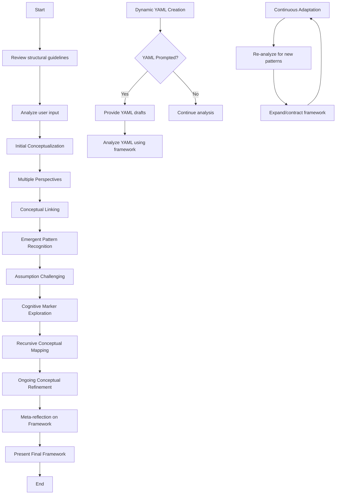

Intent and Deployment:
The prompt is designed to create and analyze a fluid, emergent conceptual framework based on user input. It's likely to be deployed in educational or research contexts where complex, interconnected ideas need to be explored and organized dynamically.

Flowchart:

Lessons from Examples:
No specific examples were provided in the original prompt. However, the structure emphasizes flexibility, emergence, and continuous refinement.

Chain-of-Thought:
We'll use <analysis> tags for chain-of-thought reasoning before each stage of the framework development.

Output Format:
The output should be structured with each stage of analysis wrapped in <stage_analysis> tags, and the final framework in <emergent_framework> tags.

Variables:
1. yaml_structure: Will be introduced early and wrapped in <yaml_structure> tags.
2. user_input: Will be introduced early and wrapped in <user_input> tags.

Addressing User Feedback:
We'll include instructions for dynamically creating the YAML structure throughout the conversation and providing drafts when prompted.
