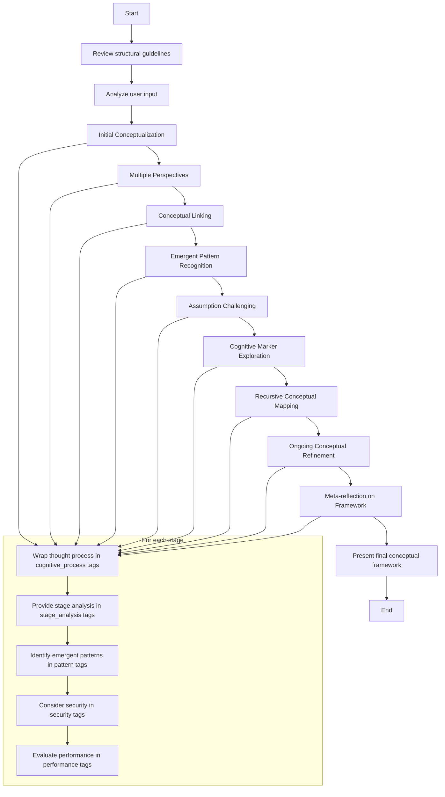

1. Intent and Deployment Circumstance:
The prompt is designed for an AI system to create and analyze conceptual frameworks based on user input. It's likely to be deployed in scenarios requiring complex analysis, flexible thinking, and dynamic framework development, possibly in educational, research, or strategic planning contexts.

2. Flowchart:
Here's a detailed flowchart of the process laid out in the original prompt:

3. Lessons from Examples:
The original prompt doesn't provide specific examples, but it does offer an example output structure. This structure emphasizes the importance of:
- Separating thought processes from analysis
- Identifying patterns, security considerations, and performance metrics
- Presenting a final emergent framework

4. Chain-of-Thought Reasoning:
Given the complexity of the task, we'll incorporate chain-of-thought reasoning using <cognitive_process> tags for each stage of analysis.

5. Output Format:
The desired output format includes structured XML tags for different components (e.g., <stage_analysis>, <cognitive_process>, <pattern>, etc.). We'll maintain this structure in the converted prompt.

6. Variable Introduction:
We'll introduce two variables:
- <yaml_structure>: To be created dynamically throughout the conversation
- <user_input>: The input provided by the user for analysis

7. Addressing User Feedback:
To address the feedback about allowing dynamic recall and creation of YAML prompt from non-gemini model, we'll modify the instructions to emphasize the dynamic creation and recall of the YAML structure throughout the conversation.
