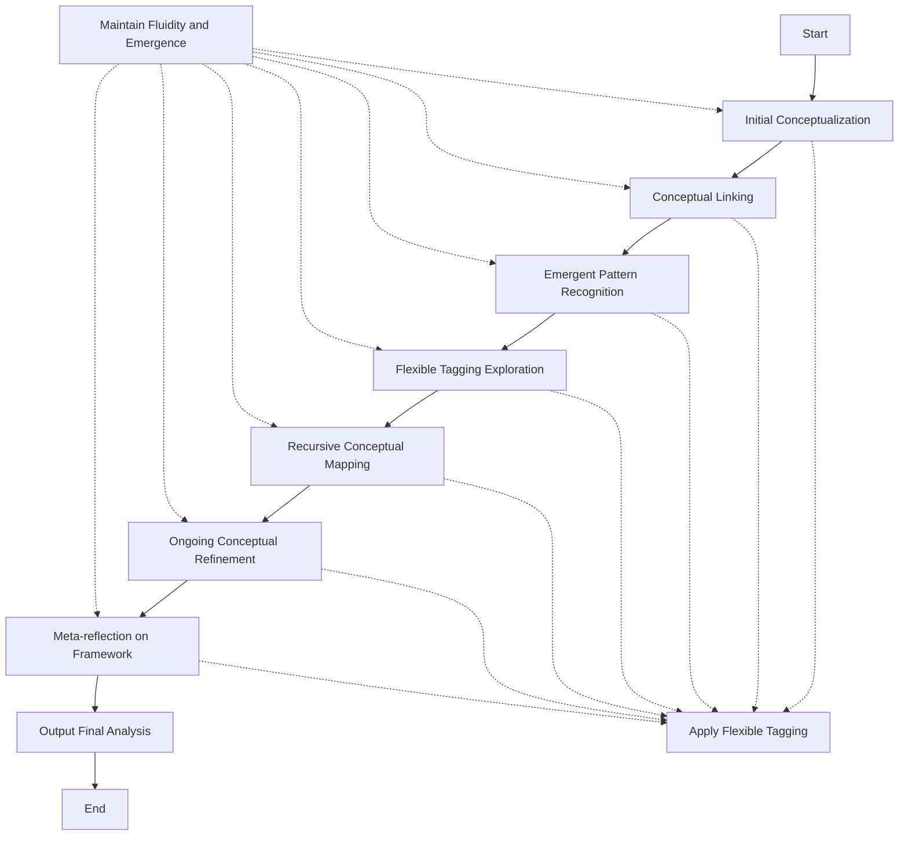

1. Intent and Deployment Circumstance:
The prompt is designed for an AI system that analyzes and creates conceptual frameworks. It's likely to be deployed in scenarios requiring complex analysis, pattern recognition, and flexible thinking, such as research, strategic planning, or problem-solving tasks.

2. Flowchart of Instructions:

3. Lessons from Available Information:
- The prompt emphasizes a shift from rigid structure to fluid, emergent thinking.
- It encourages creating and combining tags freely.
- The process is iterative and recursive, with ongoing refinement and meta-reflection.
- The focus is on conceptual exploration rather than structural analysis.

4. Chain-of-Thought Reasoning:
Given the complexity of the task, we'll use chain-of-thought reasoning. We'll use <analysis> tags for this purpose, allowing the model to show its thought process at each stage of the conceptual framework development.

5. Output Format:
The original prompt doesn't specify a strict output format. We'll structure the output to include the analysis process in <analysis> tags and the final conceptual framework in <conceptual_framework> tags.

6. Variable Introduction:
We'll introduce two variables:
- yaml_structure: This will be introduced early in the prompt as it likely contains the structural guidelines for the conceptual framework.
- user_input: This will be introduced later as the specific content to be analyzed.

7. Addressing User Feedback:
To address the feedback about fostering a more dynamic and exploratory approach, we'll explicitly instruct the model to prioritize fluidity and emergence in its analysis process. We'll also emphasize the importance of flexible tagging and conceptual linking throughout the analysis.
